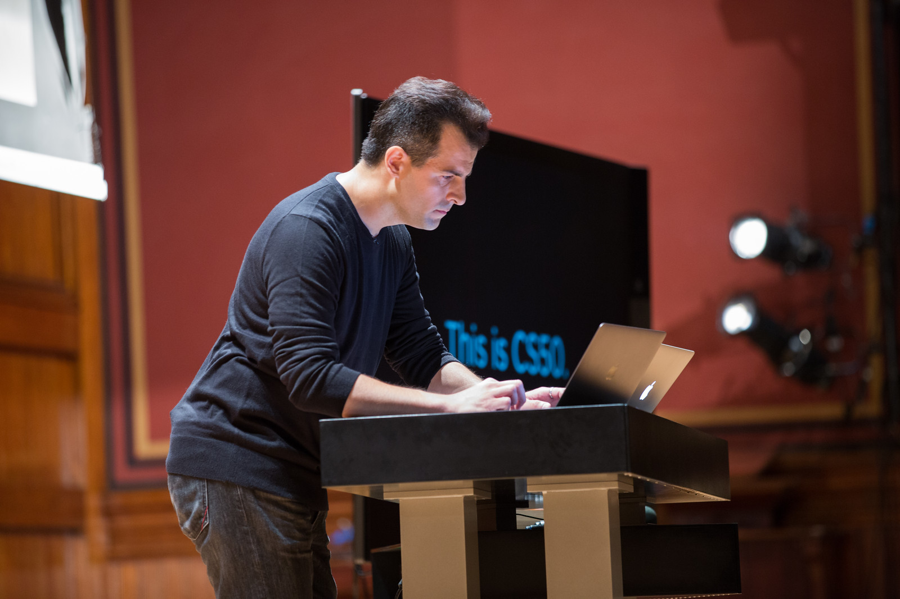

:toc: left 
:toclevels: 3

= Day 0

.David Malan prepping for lecture 0 
[caption=""]

So it begins... 

You're about to stand in front of a group of teenage students and say "This is CS50." You're nevrous, but on the surface you look calm and ready. 

Here is a short list of things to consider to help you feel under control and this first day go smoothly.

== Websites to Whitelist

To properly set up the CS50 student experience, be sure to have your school or district whitelist the following websites.

|===
|Programming and Debugging |Grading and Submission of Assignments |Reference and Course Materials
 
|*.edx.org
|*.github.com
|*.cs50.harvard.edu
 
|*.c9.io
|*.cs50.me
|*.cs50.net
 
|*.cs50.io
|
|*.cs50.tv
|===

== Checklist

* [ ] Websites whitelisted
* [ ] Obtained CS50 swag (email ap@cs50.harvard.edu if not)
* [ ] Plan a link:../events/puzzleday.html[puzzleday]
* [ ] Review link:../curriculumstartup.html#_chapter_0_computers_and_computing_completion_time_3_weeks[Chapter 0 materials]
* [ ] Ensure website is set up
* [ ] Ensure CS50.me is set up
* [ ] Have students link:../resources/cs50ide.html#_cs50_ide_setup[register for edX] in order to use the CS50 IDE.