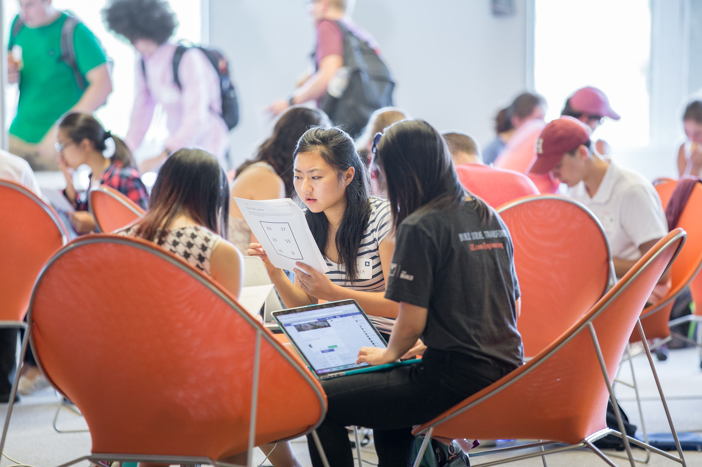
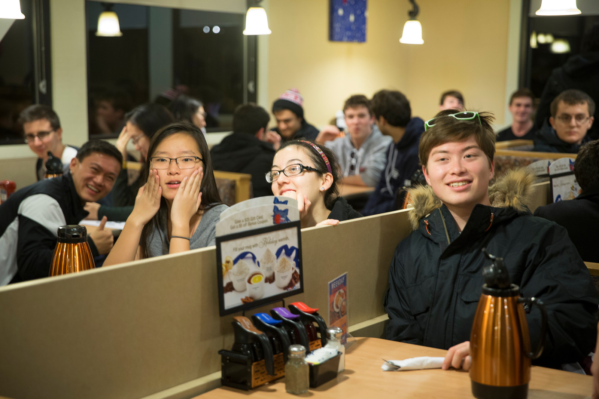
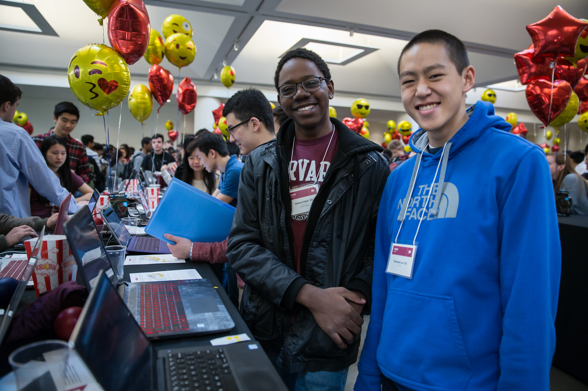

= CS50 Events

== Purpose

Events are an essential part of the CS50 AP experience. They help develop a rich culture and play a crutial part in expanding the course. The following CS50 events are held annually on campus at Harvard. Click the events to learn more information about bringing each event to your school.

== Event Info

*link:../events/puzzleday.html[CS50 Puzzle Day]*

.Students work on puzzles during CS50 Puzzle Day 2016
[caption=""]

---

*link:../events/hackathon.html[CS50 Hackathon]*

.Students enjoy well-deserved IHOP at the end of the all-night CS50 Hackathon
[caption=""]

---

*link:../events/cs50fair.html[CS50 Fair]*

.Students display their projects at the 2016 CS50 Fair
[caption=""]
