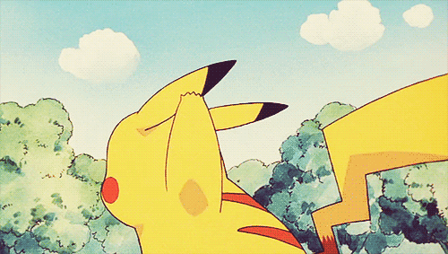

:toc: left 
:toclevels: 3

= CS50 AP Playbook

== Welcome

O hai! We're happy to welcome you aboard the CS50 AP train. We want to provide you with as much resources and guidance to make your become More Comfortable with teaching CS50 AP.

This playbook aims to help startup your CS50 AP course and create a rich CS50 experience at your school. This page is a launchpad to all the contents of the playbook.

== CS50 AP Overview

CS50 AP is broken into seven chapters with two optional chapters.  Also essential to CS50 AP are the various events that mirror the events held on campus at Harvard.  The following is a suggestled flow of topics, events, and AP CSP tasks for the school year.

.Year at a Glance
****
*CS50 Puzzle Day* +
*Chapter 0:* Computers and Computing +
*AP CSP Explore Task* +
*Chapter 1:* Building Blocks of Programming +
*Chapter 2:* Putting the Blocks Together +
*Chapter 3:* Thinking Computationally +
*Chapter 4:* Design, Elegance, and Efficiency +
*Chapter 5:* Networking and the Internet +
*Chapter 6:* Problem Solving in an Interconnected World +
*AP CSP Create Task* +
*CS50 Hackathon* +
*CS50 Fair* +
*AP CSP Exam* +
*Chapter A:* Managing Data (Optional) +
*Chapter B:* Developer’s Toolbox (Optional) +
****

== Playbook Contents

=== 0. link:../day0.html[Day 0 Help Guide]

=== 1. link:../insight.html[CS50 AP Teacher Insights]

=== 2. link:../grading.html[Grading]

=== 3. link:../events/events.html[CS50 Events]
* link:../events/puzzleday.html[CS50 Puzzle Day]
* link:../events/hackathon.html[CS50 Hackathon]
* link:../events/cs50fair.html[CS50 Fair]

=== 4. link:../apcsp.html[Information on AP CSP]
* Performance Tasks
** Explore Task
** Create Task
* AP Exam

=== 5. Technology and Resources
* link:../resources/cs50ide.html[CS50 IDE]
* link:../resources/cs50.me.html[CS50.me]

=== 6. link:../curriculumstartup.html[Curriculum Overview and Startup Guide]

== Thank You...

...for all that you do in teaching this course! Really, you're amazing!

image::assets/slowclap.gif[slowclap]