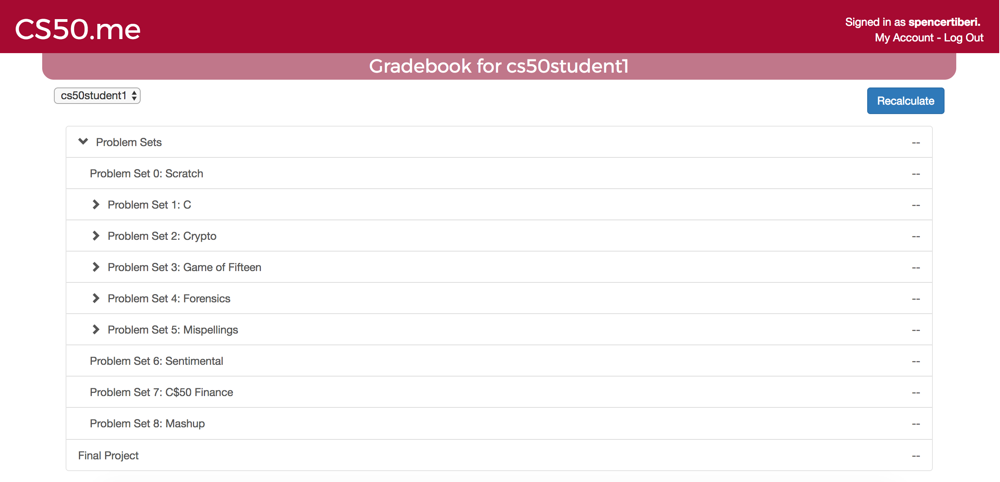

:toc: left 
:toclevels: 3

= CS50.me

== What is it?
 
https://CS50.me[*CS50.me*] is a grading and reporting platform for CS50. Both students and teachers log in to CS50.me using their https://github.com[github] credentials. Students will have access to their grades for problems broken down into the axes of *Correctness*, *Design*, and *Style*.

== Brief Overview of Features
* *Correctness* is automatically graded when student uses submit50 to submit a finished problem through the CS50 IDE. These scores will populate for the respective problem in CS50.me. However, teachers have the ability to change grades if need be.

* *Style* is also automatically graded and populated when student uses submit50 to submit a finished problem through the CS50 IDE. Again, teachers have the ability to change grades if need be.

== Quick Tour
 
=== Gradebook
 
.cs50student1's empty gradebook on CS50.me
[caption=""]

== Submission of Assignments and Grading
Each student enrolled in a section created by the teacher has access to their own gradebook.  When a student submits code from their IDE using the `submit50` command, the assignment is automatically graded on the axes of *Correctness* and *Style*. These scores may be changed if the teacher so desires. This leaves only the *Design* aspect of the code to be scored by the teacher.

To aid in grading for *Design*, teachers may comment student submissions though CS50.me.

For more information on usage of CS50.me, https://path/to/cs50.me/manual[check out its manual].
